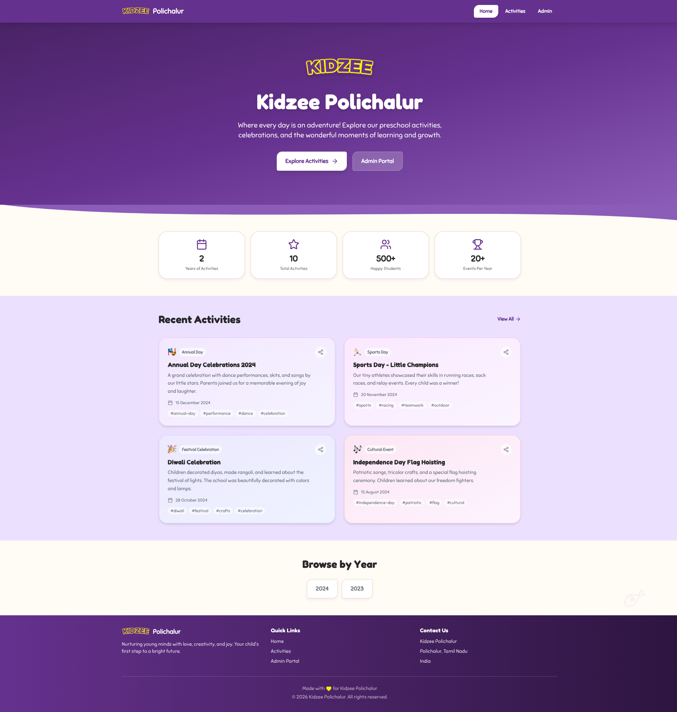
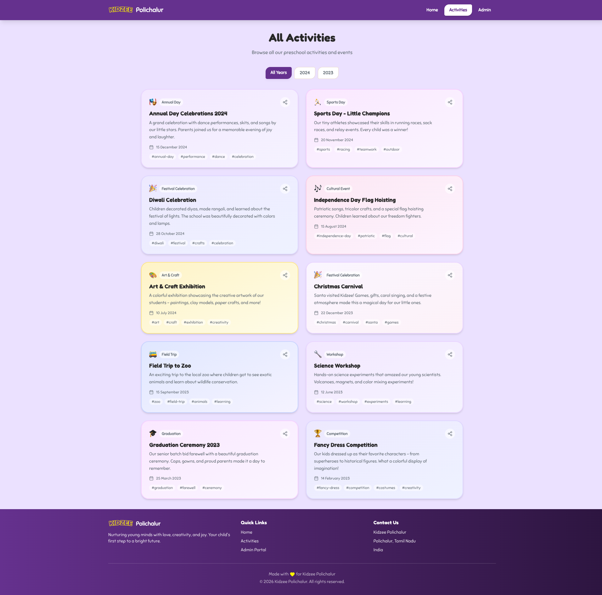
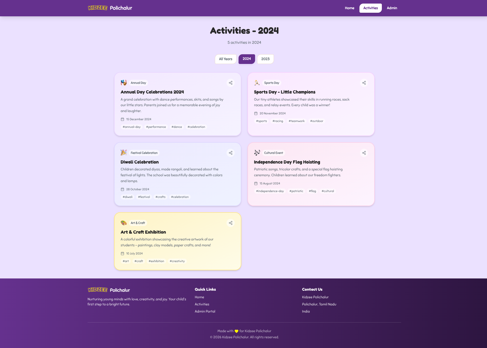
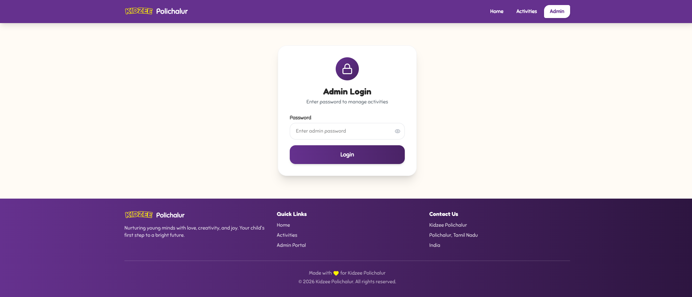
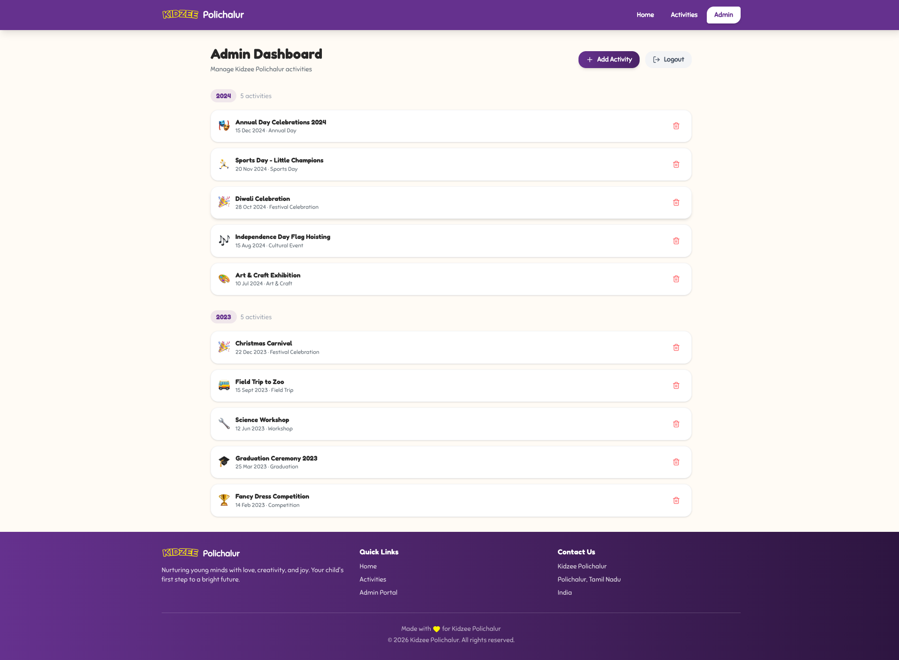
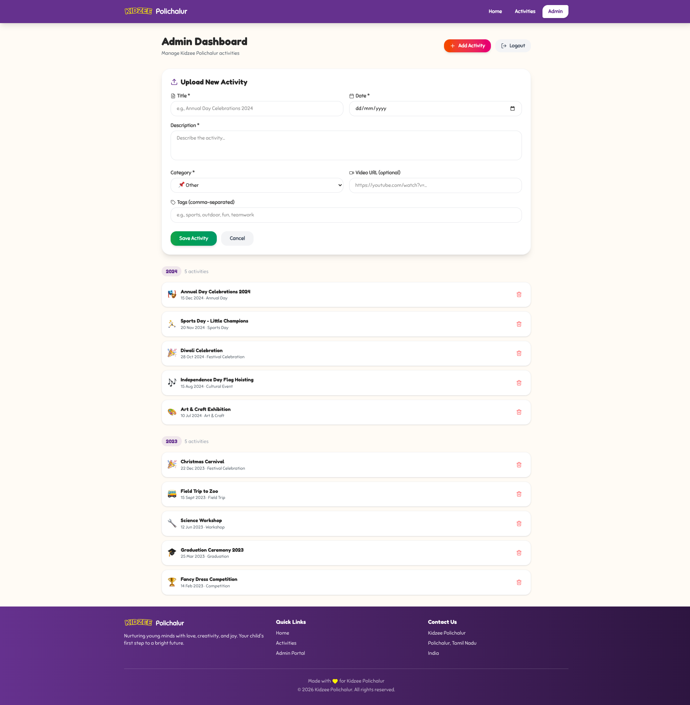
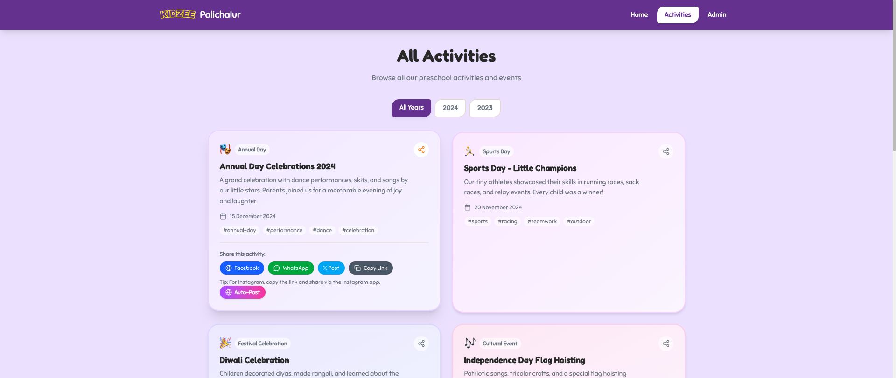

# Kidzee Polichalur — Stakeholder Review

> **Prepared by:** Aldrin Stellus (aldrin@atc.xyz)
> **Date:** 29 March 2026
> **Version:** 1.0.0
> **Live URL:** https://kidzee-polichalur.vercel.app
> **Repository:** github.com/aldrinstellus/zoo-crm (private, `apps/kidzee-polichalur/`)
> **Contact:** Imtiaz (Kidzee Polichalur franchise owner)

---

## Table of Contents

1. [Executive Summary](#1-executive-summary)
2. [Platform Overview](#2-platform-overview)
3. [Public Portal — Parent/Visitor Experience](#3-public-portal)
4. [Admin Portal — Teacher/Staff Experience](#4-admin-portal)
5. [Social Media Integration](#5-social-media-integration)
6. [Happy Path Workflows](#6-happy-path-workflows)
7. [Design System & Brand Alignment](#7-design-system--brand-alignment)
8. [Technical Architecture](#8-technical-architecture)
9. [Data Model & API Reference](#9-data-model--api-reference)
10. [Accessibility & Compliance](#10-accessibility--compliance)
11. [Known Limitations](#11-known-limitations)
12. [Roadmap — What's Next](#12-roadmap--whats-next)
13. [Screenshots](#13-screenshots)

---

## 1. Executive Summary

Kidzee Polichalur is a web-based activity showcase platform built for the Kidzee Polichalur preschool franchise in Tamil Nadu, India. The platform enables:

- **Parents & visitors** to browse preschool activities, celebrations, and events
- **Admin/teachers** to manage activities through a password-protected dashboard
- **Social media scheduling** for Instagram and Facebook auto-posting

The platform is live at **https://kidzee-polichalur.vercel.app** and is part of the ZOO CRM monorepo, sharing a design system with other franchise apps.

**Key Metrics:**
- 5 public pages + 2 admin pages
- 4 API endpoints (auth, activities CRUD, seed, social)
- 10 activity categories
- 6 social sharing channels (Facebook, WhatsApp, Twitter/X, YouTube, Instagram, Copy Link)
- WCAG 2.1 AA compliant (0 contrast violations)
- Mobile-first responsive design
- Brand-aligned with Kidzee parent site (kidzee.com)

---

## 2. Platform Overview

### 2.1 App Structure

| Page | URL | Access | Purpose |
|------|-----|--------|---------|
| Homepage | `/` | Public | Hero, stats, recent activities, year browse |
| All Activities | `/activities` | Public | Full activity list with year filter |
| Year Activities | `/activities/{year}` | Public | Activities filtered by year |
| Admin Login | `/admin/login` | Public | Password gate for admin access |
| Admin Dashboard | `/admin` | Protected | CRUD for activities, social scheduling |

### 2.2 User Roles

| Role | Access | Capabilities |
|------|--------|-------------|
| **Parent/Visitor** | Public pages only | Browse activities, share to social media, view by year |
| **Admin/Teacher** | All pages | Add/delete activities, schedule social posts, manage content |

---

## 3. Public Portal

### 3.1 Homepage



**Sections (top to bottom):**

1. **Sticky Header** — Official Kidzee logo + "Polichalur" text, navigation links (Home, Activities, Admin), hamburger menu on mobile
2. **Hero Section** — Purple gradient background (#4A2366 → #65318E → #8B5CB8), official Kidzee logo, tagline "Where every day is an adventure!", two CTA buttons:
   - "Explore Activities" → navigates to `/activities`
   - "Admin Portal" → navigates to `/admin`
   - Decorative illustrations (butterfly, balloon, bird) positioned as background elements
3. **Wave Divider** — SVG organic wave separating hero from content
4. **Stats Section** — 4 metric cards:
   - Years of Activities (dynamic count)
   - Total Activities (dynamic count)
   - Happy Students (500+)
   - Events Per Year (20+)
5. **Recent Activities** — Latest 4 activities displayed as gradient cards on lavender (#EBE1FF) background, each showing category emoji, title, description, date, tags, share button
6. **Browse by Year** — Year pill buttons with asymmetric border-radius, linking to year-specific pages
7. **Footer** — Purple gradient, Kidzee logo, mission statement, quick links, contact info, copyright

### 3.2 All Activities Page



**Features:**
- Page title "All Activities" with subtitle
- **Year Selector** — horizontal pill button group: "All Years" (active by default) + year buttons (2024, 2023, etc.)
- **Activity Grid** — 2-column responsive grid (1 column on mobile)
- Lavender (#EBE1FF) background throughout
- Each activity displayed as an ActivityCard component

### 3.3 Year-Filtered Activities



**Features:**
- Page title "Activities - {year}" with count (e.g., "5 activities in 2024")
- Year selector with current year highlighted in purple
- Filtered activity grid for selected year
- Empty state with emoji if no activities for that year

### 3.4 Activity Card Component

Each activity is displayed as a rich card with:

| Element | Details |
|---------|---------|
| **Category Badge** | Emoji + label (e.g., "🎭 Annual Day") on white/60 pill |
| **Title** | Bold heading |
| **Description** | 2-3 line summary |
| **Date** | Formatted as "15 December 2024" (India locale) |
| **Tags** | Hashtag pills (e.g., #performance, #dance, #celebration) |
| **Share Button** | Expands share panel on click |
| **Video Link** | Red "Watch Video" link if video URL provided |
| **Background** | Rotating purple-family gradient (7 color schemes) |
| **Hover Effect** | Lifts card up (-translate-y-1) + enhanced shadow |

**10 Activity Categories:**

| Category | Emoji | Label |
|----------|-------|-------|
| annual-day | 🎭 | Annual Day |
| sports-day | 🏃 | Sports Day |
| art-craft | 🎨 | Art & Craft |
| field-trip | 🚌 | Field Trip |
| festival | 🎉 | Festival Celebration |
| graduation | 🎓 | Graduation |
| workshop | 🔧 | Workshop |
| competition | 🏆 | Competition |
| cultural | 🎶 | Cultural Event |
| other | 📌 | Other |

---

## 4. Admin Portal

### 4.1 Admin Login



**Flow:**
1. User navigates to `/admin` → redirected to `/admin/login` if not authenticated
2. Enters admin password in the password field (with show/hide toggle)
3. Clicks "Login" → POST to `/api/auth`
4. On success → token stored in sessionStorage → redirected to `/admin`
5. On failure → red error message displayed below form

**Credentials:** Password set via `ADMIN_PASSWORD` environment variable

### 4.2 Admin Dashboard



**Layout:**
- Header with title "Admin Dashboard" + subtitle
- Two action buttons: "Add Activity" (toggle form) + "Logout"
- Activities listed below, grouped by year (newest first)

**Activity List:**
- Year group headers showing year badge + activity count (e.g., "2024 — 5 activities")
- Each activity row shows: category emoji + title + date + category label
- Delete button (trash icon) on each row — click shows confirmation, then deletes via API

### 4.3 Add Activity Form



**Fields:**

| Field | Type | Required | Notes |
|-------|------|----------|-------|
| Title | Text input | Yes | Activity name |
| Date | Date picker | Yes | Year auto-extracted |
| Description | Textarea (3 rows) | Yes | Detailed description |
| Category | Dropdown (10 options) | Yes | See category table above |
| Video URL | URL input | No | YouTube or video link |
| Tags | Text input | No | Comma-separated, auto-lowercased |

**Submission:**
- Validates required fields
- POST to `/api/activities` with Bearer token
- Server generates ID, timestamps, year
- Form resets on success
- Activity appears in the list immediately

---

## 5. Social Media Integration

### 5.1 Share Panel



**Triggered by:** clicking the share icon on any activity card

**Available Channels:**

| Platform | Button Color | Action |
|----------|-------------|--------|
| **Facebook** | Blue (#2563EB) | Opens Facebook share dialog with activity URL |
| **WhatsApp** | Green (#16A34A) | Opens WhatsApp with pre-formatted message + link |
| **Twitter/X** | Sky (#0EA5E9) | Opens tweet composer with title + URL |
| **YouTube** | Red (#DC2626) | Links to video URL (if provided) |
| **Copy Link** | Gray (#4B5563) | Copies direct link to clipboard (with "Copied!" feedback) |
| **Instagram** | Tip text | Instructions to copy link and share via Instagram app |

**Share URL Format:** `{BASE_URL}/activities/{year}#activity-{id}`

### 5.2 Auto-Post Scheduling

**Triggered by:** "Auto-Post" button within share panel

**Flow:**
1. Click "Auto-Post" gradient button (purple → pink)
2. Modal expands with:
   - **Platform selector** — Instagram / Facebook / Both (toggle buttons)
   - **Caption preview** — auto-generated formatted text
   - **Image count** indicator
   - "Schedule Post" button
3. Select platform → review caption → click "Schedule Post"
4. POST to `/api/social` → post queued with status "queued"
5. Success animation → modal auto-closes after 2 seconds

**Auto-Generated Caption Format:**
```
✨ {Activity Title}

{Activity Description}

🏫 Kidzee Polichalur — Where little minds bloom!

#Kidzee #KidzeePolichalur #PreschoolFun #EarlyLearning
#LittleLearners #PreschoolLife #{activity-specific-tags}
```

**Post Statuses:** queued → published / failed

---

## 6. Happy Path Workflows

### 6.1 Parent Browsing Activities

```
1. Parent opens https://kidzee-polichalur.vercel.app
2. Sees hero section with Kidzee branding + recent activities
3. Clicks "Explore Activities" button
4. Lands on /activities — sees all 10 activities with year filter
5. Clicks "2024" year pill to filter
6. Browses 5 activities from 2024
7. Clicks share icon on "Annual Day Celebrations 2024"
8. Share panel expands — clicks WhatsApp button
9. WhatsApp opens with pre-formatted message + link
10. Sends to family group
```

### 6.2 Admin Adding an Activity

```
1. Teacher navigates to /admin
2. Redirected to /admin/login (no session)
3. Enters password: ******* → clicks Login
4. Authenticated → redirected to /admin dashboard
5. Sees 10 existing activities grouped by year
6. Clicks "Add Activity" button — form expands
7. Fills in:
   - Title: "Republic Day Celebration"
   - Date: 2025-01-26
   - Description: "Patriotic performances and flag hoisting..."
   - Category: Cultural Event
   - Tags: republic-day, patriotic, flag
8. Clicks "Add Activity" submit button
9. Activity created → appears at top of 2025 group
10. Teacher clicks share icon → schedules auto-post to Instagram
```

### 6.3 Admin Deleting an Activity

```
1. Admin is logged in on /admin dashboard
2. Scrolls to find "Fancy Dress Competition" under 2023
3. Clicks trash icon on that row
4. Confirmation dialog appears
5. Confirms deletion
6. Activity removed from list immediately
7. Public pages no longer show the activity
```

### 6.4 Scheduling a Social Media Post

```
1. Admin views activity card (on dashboard or public page)
2. Clicks share icon → share panel opens
3. Clicks "Auto-Post" gradient button
4. Scheduling modal expands:
   a. Selects "Both" (Instagram + Facebook)
   b. Reviews auto-generated caption with hashtags
   c. Sees "0 images" indicator (no images uploaded yet)
5. Clicks "Schedule Post"
6. Loading spinner → "Queued!" success message
7. Modal auto-closes after 2 seconds
8. Post saved with status "queued" in data/social-posts.json
```

---

## 7. Design System & Brand Alignment

### 7.1 Brand DNA (from kidzee.com analysis)

The platform's design was distilled from the official Kidzee parent site to feel like part of the Kidzee family without being a direct copy.

**Brand Elements Applied:**

| Element | Parent (kidzee.com) | Polichalur App | Status |
|---------|-------------------|----------------|--------|
| Primary color | #65318E (purple) | #65318E | Aligned |
| Body font | Sniglet | Sniglet | Aligned |
| Display font | Fredoka | Fredoka | Aligned |
| Section backgrounds | Lavender #EBE1FF | Lavender #EBE1FF | Aligned |
| Button shape | Asymmetric 15px 5px | Asymmetric blob | Aligned |
| Shadows | Standard | Purple-tinted rgba(101,49,142) | Enhanced |
| Motion | Standard | Bouncy cubic-bezier(0.34,1.56,0.64,1) | Enhanced |
| Decorative elements | Monkey, butterfly, fish | Butterfly, balloon, bird, fish | Adapted |
| Logo | Official SVG | Official SVG (from kidzee.com) | Aligned |

**Local Identity (intentional differences):**
- Warm cream page background (#FFFBF5) — warmer than parent's white
- Mobile-first design — parent is desktop-focused
- Activity-focused content model — parent is corporate franchise site
- Social media integration — parent has none

### 7.2 Color Palette

| Token | Value | Usage |
|-------|-------|-------|
| Primary | #65318E | Headers, buttons, accents |
| Primary Dark | #4A2366 | Hero gradient start, CTA gradient |
| Primary Light | #8B5CB8 | Hero gradient end, hover states |
| Accent | #FFF200 | Badges, highlights |
| Accent Warm | #FFC107 | Warm accents |
| Background | #FFFBF5 | Page background (warm cream) |
| Background Brand | #EBE1FF | Activity sections (lavender) |
| Surface | #FFFFFF | Cards, modals |
| Text | #282828 | Body text |
| Text Secondary | #6C757D | Subtitles, metadata |

### 7.3 Typography

| Role | Font | Weights | Usage |
|------|------|---------|-------|
| Display | Fredoka | 300–700 | Headings, hero text, stat values |
| Body | Sniglet | 400 | Body text, descriptions, labels |
| Accent | Lato | 300–900 | Fallback, accent text |

### 7.4 Responsive Breakpoints

| Breakpoint | Width | Layout Changes |
|------------|-------|---------------|
| Mobile | < 640px | Single column, hamburger nav, compact cards |
| Tablet | 640–767px | 2-column stats, larger text |
| Desktop | 768px+ | 2-column activity grid, 4-column stats, full nav |

### 7.5 Mobile View


---

## 8. Technical Architecture

### 8.1 Tech Stack

| Layer | Technology | Details |
|-------|-----------|---------|
| **Framework** | Next.js 16.2.1 | App Router, Turbopack, Server Components |
| **Language** | TypeScript | Strict mode |
| **Styling** | Tailwind CSS v4 | Utility-first, JIT compilation |
| **Design System** | @zoo/design-tokens + @zoo/ui | Shared monorepo packages |
| **Icons** | Lucide React | Tree-shakeable SVG icons |
| **Data Storage** | JSON files (filesystem) | `/data/activities.json`, `/data/social-posts.json` |
| **Auth** | Password + sessionStorage | Simple token-based |
| **Hosting** | Vercel | Automatic deployments on git push |
| **Monorepo** | npm workspaces | Part of zoo-crm monorepo |

### 8.2 Project Structure

```
apps/kidzee-polichalur/
├── src/
│   ├── app/
│   │   ├── page.tsx                    # Homepage
│   │   ├── layout.tsx                  # Root layout (fonts, header, footer)
│   │   ├── activities/
│   │   │   ├── page.tsx                # All activities
│   │   │   └── [year]/page.tsx         # Year-filtered activities
│   │   ├── admin/
│   │   │   ├── page.tsx                # Admin dashboard (protected)
│   │   │   └── login/page.tsx          # Admin login
│   │   └── api/
│   │       ├── auth/route.ts           # POST: authenticate
│   │       ├── activities/route.ts     # GET/POST/DELETE: CRUD
│   │       ├── seed/route.ts           # POST: seed demo data
│   │       └── social/route.ts         # GET/POST: social scheduling
│   ├── components/
│   │   ├── header.tsx                  # Sticky nav with logo
│   │   ├── footer.tsx                  # Purple gradient footer
│   │   ├── activity-card.tsx           # Activity display card + share
│   │   ├── year-selector.tsx           # Year filter pills
│   │   ├── social-share-button.tsx     # Auto-post scheduling modal
│   │   └── wave-divider.tsx            # SVG section divider
│   └── lib/
│       ├── data.ts                     # File I/O for activities
│       ├── types.ts                    # TypeScript interfaces + enums
│       ├── social.ts                   # Share URL generation
│       ├── social-posts.ts            # Social post data layer
│       ├── seed.ts                    # Demo activity data
│       └── cn.ts                      # Tailwind class merge utility
├── public/
│   ├── kidzee-logo.svg               # Official Kidzee logo
│   └── decorative/                    # Brand illustrations
│       ├── butterfly.png
│       ├── balloon.png
│       ├── bird.png
│       └── fish.png
├── data/
│   ├── activities.json                # Activity records
│   └── social-posts.json             # Queued social posts
└── docs/
    ├── BRAND-DNA-RESEARCH.md          # Brand analysis document
    ├── design-system/                 # Design system docs
    ├── stakeholder-docs/              # This document + screenshots
    └── requirements-gap-analysis.md   # Feature gap analysis
```

### 8.3 Deployment

- **Platform:** Vercel (free tier)
- **URL:** https://kidzee-polichalur.vercel.app
- **Trigger:** Automatic on push to `main` branch of zoo-crm repo
- **Environment Variables:** `ADMIN_PASSWORD`, `NEXT_PUBLIC_BASE_URL`
- **Build:** `next build` via Turbopack (~3.5s)

---

## 9. Data Model & API Reference

### 9.1 Activity Schema

| Field | Type | Required | Example |
|-------|------|----------|---------|
| id | string | Auto | "1711700000000" |
| title | string | Yes | "Annual Day Celebrations 2024" |
| description | string | Yes | "A grand celebration with dance..." |
| date | string (ISO) | Yes | "2024-12-15" |
| year | number | Auto | 2024 |
| category | ActivityCategory | Yes | "annual-day" |
| images | string[] | Auto | [] |
| videoUrl | string | No | "https://youtube.com/watch?v=..." |
| tags | string[] | No | ["annual-day", "performance", "dance"] |
| createdAt | string (ISO) | Auto | "2026-03-29T10:00:00.000Z" |
| updatedAt | string (ISO) | Auto | "2026-03-29T10:00:00.000Z" |

### 9.2 Social Post Schema

| Field | Type | Required | Example |
|-------|------|----------|---------|
| id | string | Auto | "1711700100000" |
| activityId | string | Yes | "1711700000000" |
| activityTitle | string | Yes | "Annual Day Celebrations 2024" |
| caption | string | Auto | "✨ Annual Day Celebrations 2024..." |
| images | string[] | Yes | [] |
| platform | "instagram" / "facebook" / "both" | Yes | "both" |
| status | "queued" / "published" / "failed" | Auto | "queued" |
| scheduledAt | string (ISO) | No | null |
| publishedAt | string (ISO) | No | null |
| createdAt | string (ISO) | Auto | "2026-03-29T10:00:00.000Z" |

### 9.3 API Endpoints

#### POST `/api/auth`
- **Access:** Public
- **Body:** `{ "password": "string" }`
- **200:** `{ "success": true, "token": "string" }`
- **401:** `{ "error": "Invalid password" }`

#### GET `/api/activities`
- **Access:** Public
- **Query:** `?year=2024` (optional)
- **200:** `Activity[]` (sorted by date DESC)

#### POST `/api/activities`
- **Access:** Protected (Bearer token)
- **Body:** `{ title, description, date, category, videoUrl?, tags[] }`
- **201:** Activity object with generated fields
- **401:** Unauthorized

#### DELETE `/api/activities`
- **Access:** Protected (Bearer token)
- **Query:** `?id=123456`
- **200:** `{ "success": true }`
- **401/404:** Error response

#### POST `/api/seed`
- **Access:** Public
- **200:** `{ "message": "Seeded successfully", "count": 10 }`

#### GET `/api/social`
- **Access:** Public
- **Query:** `?activityId=123` (optional)
- **200:** `SocialPost[]`

#### POST `/api/social`
- **Access:** Public
- **Body:** `{ activityId, activityTitle, description, images[], platform, tags[] }`
- **201:** `{ post: SocialPost, preview: { caption, platform, imageCount } }`

---

## 10. Accessibility & Compliance

### 10.1 WCAG 2.1 AA Audit Results

| Page | Contrast Issues | Status |
|------|----------------|--------|
| Homepage (`/`) | 0 | PASS |
| All Activities (`/activities`) | 0 | PASS |
| Year Activities (`/activities/2024`) | 0 | PASS |
| Admin Login (`/admin/login`) | 0 | PASS |
| Admin Dashboard (`/admin`) | 0 | PASS |

### 10.2 Accessibility Features

| Feature | Implementation |
|---------|---------------|
| Semantic HTML | `<header>`, `<main>`, `<footer>`, `<nav>`, `<h1>`-`<h6>` hierarchy |
| Keyboard Navigation | All interactive elements focusable, tab order correct |
| ARIA Labels | Share buttons, menu toggle, form fields all labeled |
| Color Contrast | All text meets 4.5:1 minimum (computed via getComputedStyle) |
| Responsive | Mobile-first, works from 320px to 2560px+ |
| Focus Indicators | Visible focus rings on all interactive elements |
| Alt Text | All decorative images marked `aria-hidden="true"`, logo has alt text |

### 10.3 Key Contrast Ratios

| Element | Foreground | Background | Ratio | Requirement | Status |
|---------|-----------|------------|-------|-------------|--------|
| Body text on cream | #282828 | #FFFBF5 | 13.8:1 | 4.5:1 | PASS |
| White text on purple hero | #FFFFFF | #65318E | 7.5:1 | 4.5:1 | PASS |
| Secondary text on cream | #6C757D | #FFFBF5 | 4.8:1 | 4.5:1 | PASS |
| White on primary button | #FFFFFF | #65318E | 7.5:1 | 4.5:1 | PASS |
| Purple on white CTA | #65318E | #FFFFFF | 7.5:1 | 4.5:1 | PASS |
| Text on lavender | #282828 | #EBE1FF | 11.2:1 | 4.5:1 | PASS |

---

## 11. Known Limitations

### 11.1 Current Limitations

| # | Limitation | Impact | Workaround |
|---|-----------|--------|------------|
| 1 | **JSON file storage** — data stored in local filesystem, not a database | Data may be lost on Vercel serverless cold starts | Seed endpoint re-populates demo data; production needs Supabase/KV |
| 2 | **No image upload** — activities have an `images[]` field but no upload UI | Activity cards show text only, no photos | Manual file upload to `/public/` and reference by path |
| 3 | **Social posts are queued, not published** — no Meta API integration yet | Posts marked "queued" but must be manually posted | Copy generated caption and post manually |
| 4 | **Simple auth** — password as plaintext token in sessionStorage | Not production-grade security | Acceptable for admin-only access on HTTPS |
| 5 | **No edit functionality** — activities can be added and deleted, but not edited | Must delete and re-create to fix typos | Add PATCH endpoint + edit form |
| 6 | **No pagination** — all activities loaded at once | Performance degrades with hundreds of activities | Add pagination or infinite scroll |
| 7 | **No search** — no text search or category filter on public pages | Users must browse manually or filter by year | Add search bar + category filter |
| 8 | **Single admin** — one shared password for all admins | No audit trail of who did what | Add user accounts with roles |

### 11.2 Security Considerations

| Area | Current State | Recommendation |
|------|--------------|----------------|
| Authentication | Password-based, sessionStorage | JWT + httpOnly cookies |
| API Protection | Bearer token on write endpoints | Add rate limiting |
| Social API | No auth required | Add Bearer token |
| HTTPS | Enforced by Vercel | N/A |
| CORS | Default Next.js settings | Configure if needed |
| Input Sanitization | Basic required field checks | Add XSS sanitization |

---

## 12. Roadmap — What's Next

### Phase 1 — Data & Storage (Priority: High)

| Feature | Description | Status |
|---------|-------------|--------|
| Supabase integration | Replace JSON files with Supabase PostgreSQL | Planned |
| Image uploads | Upload photos for each activity via admin | Planned |
| Activity editing | PATCH endpoint + edit form in admin dashboard | Planned |
| Data backup | Automated backup of activity data | Planned |

### Phase 2 — User Experience (Priority: Medium)

| Feature | Description | Status |
|---------|-------------|--------|
| Search & filter | Text search + category filter on activities page | Planned |
| Pagination | Load activities in pages (10 per page) | Planned |
| Activity detail page | Full-page view with gallery, video embed, comments | Planned |
| Photo gallery | Grid/carousel view for activity images | Planned |
| Parent notifications | WhatsApp alerts for new activities | Planned |

### Phase 3 — Social Media (Priority: Medium)

| Feature | Description | Status |
|---------|-------------|--------|
| Meta API integration | Auto-publish to Instagram/Facebook (not just queue) | Planned |
| Scheduled posting | Set date/time for auto-publish | Planned |
| Post analytics | Track engagement on published posts | Planned |
| Bulk scheduling | Schedule multiple activities at once | Planned |

### Phase 4 — Platform Expansion (Priority: Low)

| Feature | Description | Status |
|---------|-------------|--------|
| Multi-admin accounts | Individual logins with audit trail | Planned |
| Parent portal | Login for parents to see their child's activities | Planned |
| Attendance integration | Track daily attendance via app | Planned |
| Fee management | Payment tracking and reminders | Planned |
| Multi-language | Tamil + Hindi support | Planned |
| PWA | Installable mobile app (offline-capable) | Planned |

---

## 13. Screenshots

All screenshots captured on 29 March 2026 from `localhost:3000`.

| # | Screenshot | Page | Description |
|---|-----------|------|-------------|
| 1 |  | `/` | Full homepage with hero, stats, activities, year browse |
| 2 |  | `/activities` | All activities with year selector |
| 3 |  | `/activities/2024` | Year-filtered view |
| 4 |  | `/admin/login` | Password gate |
| 5 |  | `/admin` | Activity management dashboard |
| 6 |  | `/admin` | Expanded add activity form |
| 7 |  | `/activities` | Social sharing panel on activity card |
| 8 |  | `/` (mobile) | iPhone 14 responsive view |

---

## Appendix A — Environment Setup

```bash
# Clone repository
git clone https://github.com/aldrinstellus/zoo-crm.git
cd zoo-crm

# Install dependencies (all workspaces)
npm install

# Set environment variables
cd apps/kidzee-polichalur
cp .env.example .env.local
# Edit .env.local:
#   ADMIN_PASSWORD=your-password
#   NEXT_PUBLIC_BASE_URL=https://kidzee-polichalur.vercel.app

# Run development server
npm run dev
# → http://localhost:3000

# Seed demo data (first run)
curl -X POST http://localhost:3000/api/seed

# Build for production
npm run build
```

## Appendix B — Demo Credentials

| Field | Value |
|-------|-------|
| Admin URL | https://kidzee-polichalur.vercel.app/admin |
| Admin Password | Set in Vercel environment variables |
| Seed Endpoint | POST `/api/seed` (creates 10 demo activities) |

---

*This document is periodically updated as features are added. Last updated: 29 March 2026.*
*Prepared by: Aldrin Stellus (aldrin@atc.xyz) — ATC Academy / ZOO CRM Platform*
